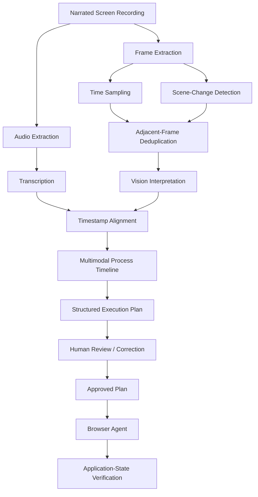

# Demonstration-Guided Agentic Automation

> **Show the process. Let the agent execute it.**

What if a business user could demonstrate how work gets done — and that demonstration could become a **reviewable, executable automation**?

This proof of concept explores a different approach to enterprise automation: instead of beginning with API contracts, workflow definitions, selectors, or detailed process documentation, the business user starts by **recording and narrating the process they already perform**.

The system interprets the recording, extracts the business intent and visual evidence, generates a structured execution plan for review, and then lets an AI agent execute the approved process against the live application UI.

For the business actions demonstrated in this POC, the agent does **not require an application-specific API or MCP tool** to perform the Salesforce record updates. Model and backend APIs are still used for interpretation, reasoning, authentication, orchestration, and system services.

---

## Demo

🎥 **60-second product demo:** https://youtu.be/gEhxQjRQ6XI

The demo shows a business user handling an urgent Salesforce case that impacts a **$285K opportunity**, followed by the agent performing the approved process through the application UI.

---

## White Paper

📄 **Architecture paper:** [Demonstration-Guided Agentic Automation](docs/Demonstration-Guided-Agentic-Automation.pdf)

The paper covers the recording interpretation pipeline, multimodal reasoning, plan generation, human review, identity, browser execution, verification, limitations, and production considerations.

---

## The Core Hypothesis

Traditional enterprise automation often looks like this:

```text
Business Process
      ↓
Requirements / Documentation
      ↓
Automation Design
      ↓
API / Workflow / RPA Implementation
      ↓
Execution
```

This POC explores a different interaction model:

```text
Demonstration
      ↓
Understanding
      ↓
Review
      ↓
Execution
```

The central question is:

> **Can demonstration become a practical form of process specification?**

The goal is not to convert a screen recording into a sequence of mouse coordinates. The goal is to infer the **business intent and process structure**, let a human review that interpretation, and then execute the approved intent against the current application state.

---

## From Recording to Understanding

A screen recording contains much more than clicks.

The screen provides visual evidence of application state and demonstrated actions. Narration can provide business meaning that may not be visible in the UI — for example:

- Why a record qualifies for an action.
- Which value is merely an example versus a reusable rule.
- Why an exception matters.
- What business outcome the user is trying to achieve.

The implementation processes the recording as a **staged multimodal pipeline**, rather than treating the full video as one opaque model request.



### 1. Extract the audio

The audio track is separated from the uploaded recording so the user's narration can be processed independently.

### 2. Transcribe the narration

The implementation attempts transcription using a model-based transcription path, with fallback support where configured.

The narration provides context that may be impossible to infer reliably from pixels alone.

### 3. Extract meaningful frames

Processing every video frame would create large amounts of redundant visual evidence.

Instead, the pipeline combines:

- **Time-based frame sampling**
- **Scene-change detection**
- **Adjacent-frame deduplication**

This keeps meaningful UI transitions while reducing repeated frames where very little has changed.

### 4. Interpret the selected screenshots

A vision-capable model describes the selected frames and captures the visible application state, relevant records, values, and demonstrated actions.

### 5. Align narration with visual evidence

Narration segments are associated with frames near the same timestamps.

This produces a richer process representation:

```text
What the user SAID
        +
What the application SHOWED
        ↓
Contextualized process understanding
```

### 6. Synthesize a structured plan

The combined timeline is converted into a structured execution plan containing the business goal, execution steps, decision logic, success conditions, required access, and failure behavior.

The recording therefore becomes **evidence for generating a plan**, not a script to be blindly replayed.

---

## The Plan Is the Execution Contract

The plan separates **interpretation** from **execution**.

Before the agent is allowed to change business records, the inferred process enters a review state.

The user can:

- Review the generated process.
- Correct an incorrect interpretation in plain language.
- Clarify ambiguous business rules.
- Approve the plan before execution.

This is important because one demonstrated example should not automatically become a universal business rule.

For example:

> Seeing a user update one case with a particular value does not necessarily mean every future case should receive that value.

The system should make uncertainty visible rather than silently inventing policy.

---

## Execution Against the Live UI

Once approved, the plan is executed by a browser-based agent against the current application interface.

The agent does **not simply replay the cursor coordinates from the recording**.

Instead, the model-guided execution loop follows the intent of the approved step:

```text
Observe current application state
        ↓
Interpret available UI / elements
        ↓
Choose the next action
        ↓
Execute
        ↓
Observe again
```

This allows the execution layer to adapt to the live UI rather than assuming the application will always appear exactly as it did in the original recording.

The executor can combine:

- Deterministic browser action sequences for known interactions.
- Model-guided actions when the current screen requires interpretation.
- Navigation and waits.
- Extraction.
- Branching and loops.
- Explicit human-input pauses.

---

## No Application-Specific API or MCP Tool for the Business Actions

A deliberate goal of this experiment is to test **UI-native execution**.

For the Salesforce operations in this POC — such as updating the case and creating the follow-up task — the business actions are carried out through the application's user interface.

```text
Approved Plan
     ↓
Authenticated Browser Session
     ↓
Agent observes the live Salesforce UI
     ↓
Agent performs the business action
```

This does **not** mean the overall system is API-free.

APIs and backend services are still used for model inference, orchestration, authentication, persistence, and other platform services.

The architectural experiment is narrower:

> **Can the agent perform the target business workflow without requiring an application-specific API or MCP tool for each business action?**

---

## User-Context Execution

The Salesforce POC connects execution to the business user's authorized identity.

The user authorizes the Salesforce connection through OAuth. The backend manages the connection and establishes an authenticated browser session for the agent.

The business actions then occur through that user-context application session and remain subject to the user's Salesforce permissions and applicable session policies.

Identity establishes **who the agent is acting as**.

It does not replace the need for independent controls defining **what automation and actions the user approved**.

---

## Verification Matters More Than a Successful Click

A browser action completing successfully does not necessarily mean the business outcome is correct.

The POC therefore treats **application state** as the stronger measure of completion.

Examples include checking:

- Whether the intended record actually changed.
- Whether records that should have been excluded remained unchanged.
- Whether a task or record was accidentally duplicated.
- Whether missing information was surfaced rather than silently ignored.

This distinction becomes increasingly important as agents move from assisting users to taking consequential actions on their behalf.

---

## Example Scenario

The demo uses a deliberately understandable Salesforce workflow.

A business user:

1. Reviews incoming cases.
2. Identifies an urgent customer issue.
3. Recognizes that the issue affects a **$285K deal**.
4. Updates / escalates the case.
5. Creates the appropriate follow-up work.
6. Assigns that work for action.

The first part of the demo shows the user performing the process manually.

The second part shows the approved automation executing the equivalent business workflow through the Salesforce UI.

The interesting part is not the individual Salesforce actions.

The experiment is the path from:

```text
"I do this every morning"
        ↓
Recorded demonstration
        ↓
Multimodal interpretation
        ↓
Reviewable plan
        ↓
Agent execution
```

---

## Architecture Principles

### Separate interpretation from execution

The user should be able to inspect and correct what the system inferred before the agent affects live business data.

### Use a structured contract between understanding and action

The execution plan allows the recording interpretation pipeline and browser execution layer to evolve independently.

### Combine deterministic and model-guided execution

Not every browser interaction needs model reasoning. Predictable actions can remain deterministic while variable situations can use live interpretation.

### Measure the business outcome

Agent traces and model-generated reasoning are useful for debugging, but the actual application state determines whether the task was completed correctly.

### Make uncertainty visible

Missing narration, ambiguous rules, incomplete recordings, and unexpected application states should lead to review, clarification, or controlled failure rather than invented business policy.

---

## Current POC Scope

The current implementation is an experimental architecture, not a production automation platform.

The reviewed POC includes:

- FastAPI backend services.
- Next.js user interface.
- SQL-backed persistence.
- Local recording artifacts.
- Browser execution in a local Docker sandbox.
- Plan review and approval.
- Execution tracing and memory experiments.

Areas that require further hardening or validation include:

- Durable execution queues.
- Scheduling and event-driven triggers.
- Production-grade sandbox isolation.
- Token and session protection.
- Reliable recovery and resume behavior.
- Stronger immutable binding between approval and executed plan versions.
- Enterprise observability and auditability.
- Policy enforcement and transaction-level guardrails.
- Evaluation of reliability across broader process types.

---

## Why This Matters

APIs, MCP, workflow engines, and deterministic automations remain important tools.

This project is not intended to replace them.

It explores another option for the long tail of enterprise work where:

- The process already exists in human behavior.
- Requirements are poorly documented.
- Application-specific integrations are expensive or unavailable.
- The UI is the practical system boundary.
- The user can demonstrate the desired outcome more easily than formally specify it.

The broader architectural opportunity is a shift from asking:

> **"How do we program this process?"**

toward also asking:

> **"Can the system learn enough from the demonstration to propose the process — and let the human approve it?"**

---

## Repository Documentation

- 📄 [White Paper](docs/Demonstration-Guided-Agentic-Automation.pdf)
- 🏗️ [Architecture](Architecture.md)
- 🎥 [Demo](ADD-DEMO-LINK)
- ⚙️ Setup / local development instructions: **retain the repository's existing setup documentation here or link to it from this section**

---

## Contributors

**Sumit Paliwal** — Problem framing, architecture, engineering guidance & overall direction.

**Shrey Sharma** — Engineering implementation & POC development.

---

## Status

This repository represents an active proof of concept exploring **demonstration-guided agentic automation**.

The architecture and implementation will continue to evolve as we test broader process patterns, reliability, verification, governance, and enterprise-scale execution.

Feedback and technical critique are welcome — particularly around multimodal process understanding, plan generation, browser-agent reliability, verification, and governance.


